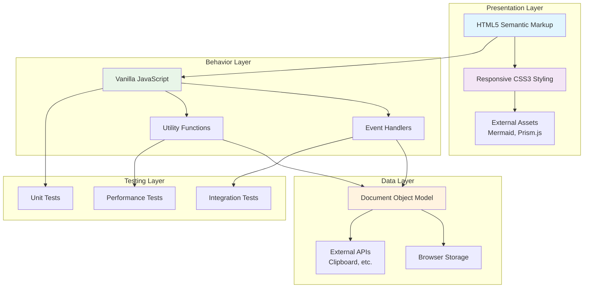
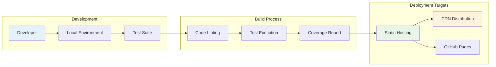
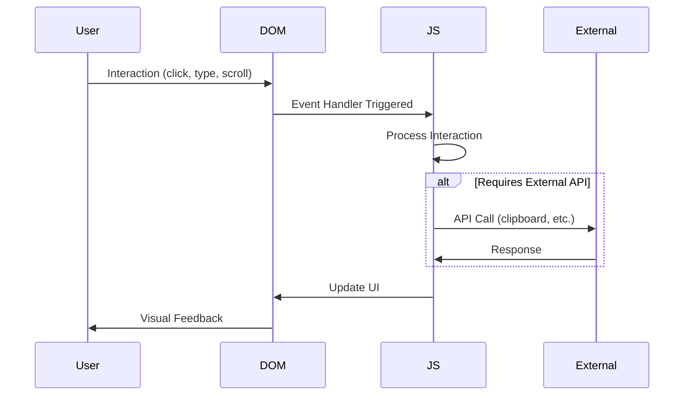
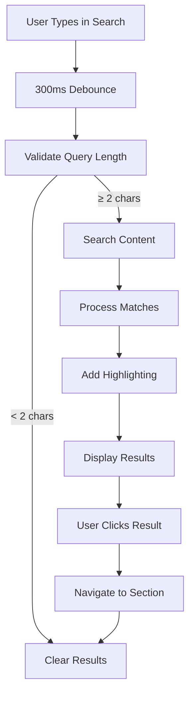

# Architecture Documentation

This document provides a comprehensive overview of the architectural decisions, design patterns, and technical choices that shape the Claude Code Agents Hooks Documentation Guide project. Understanding this architecture will help developers make informed decisions when extending or modifying the codebase.

## Table of Contents

- [Architectural Overview](#architectural-overview)
- [Design Principles](#design-principles)
- [System Architecture](#system-architecture)
- [Component Architecture](#component-architecture)
- [Data Flow](#data-flow)
- [Technology Choices](#technology-choices)
- [Performance Architecture](#performance-architecture)
- [Security Architecture](#security-architecture)
- [Testing Architecture](#testing-architecture)
- [Future Architecture Considerations](#future-architecture-considerations)

## Architectural Overview

### Philosophy

The Claude Code Agents Hooks Documentation Guide follows a **progressive enhancement** architecture built on these core principles:

1. **Content First**: Core information is accessible without JavaScript
2. **Layer Enhancement**: Interactive features enhance but don't replace basic functionality
3. **Performance Focus**: Optimized for fast loading and smooth interactions
4. **Accessibility Built-in**: Designed for universal access from the ground up
5. **Maintainable Code**: Clear structure that scales with project growth

### Architecture Diagram



### Key Architectural Decisions

#### 1. **Static Site Architecture**
- **Decision**: Build as a static documentation site
- **Rationale**: 
  - Simplifies deployment and hosting
  - Excellent performance characteristics
  - Easy to maintain and update
  - Works well with CDN distribution
- **Trade-offs**: No server-side functionality, limited to client-side features

#### 2. **Vanilla JavaScript Approach**
- **Decision**: Use vanilla JavaScript instead of frameworks
- **Rationale**:
  - Minimal bundle size and fast loading
  - No framework lock-in or update dependencies
  - Direct control over performance optimization
  - Simpler debugging and maintenance
- **Trade-offs**: More boilerplate code, manual state management

#### 3. **Component-Based CSS**
- **Decision**: Organize CSS by components rather than pages
- **Rationale**:
  - Better maintainability and reusability
  - Easier to reason about styling
  - Supports modular development approach
  - Scales better with project growth
- **Trade-offs**: Requires discipline to maintain organization

## Design Principles

### 1. Progressive Enhancement

The site is built in layers, each adding functionality while maintaining the previous layer's capabilities:

```
Layer 4: Advanced Interactions (Search, Copy, Progress)
Layer 3: Enhanced Styling (Animations, Hover Effects)
Layer 2: Basic Styling (Layout, Typography, Colors)
Layer 1: Semantic HTML (Content, Structure, Navigation)
```

**Implementation**: 
- Core content is fully accessible in HTML-only mode
- CSS provides visual enhancement without breaking functionality
- JavaScript adds interactivity while preserving basic navigation

### 2. Mobile-First Responsive Design

The responsive strategy prioritizes mobile users while scaling up to larger screens:

```css
/* Mobile-first approach */
.content-wrapper {
    display: block;  /* Single column for mobile */
}

@media (min-width: 768px) {
    .content-wrapper {
        display: grid;  /* Grid layout for desktop */
        grid-template-columns: 250px 1fr;
    }
}
```

**Benefits**:
- Better mobile performance (smaller initial CSS)
- Forces focus on essential content and features
- Easier to enhance than to subtract features

### 3. Accessibility-First Development

Accessibility is not an afterthought but a core architectural constraint:

- **Semantic HTML**: Proper heading hierarchy, landmark regions
- **Keyboard Navigation**: All interactive elements accessible via keyboard
- **Screen Reader Support**: ARIA attributes and meaningful text
- **Visual Accessibility**: High contrast, scalable text, clear focus indicators

### 4. Performance as a Feature

Performance considerations are built into every architectural decision:

- **Minimal Dependencies**: Only essential external libraries
- **Efficient DOM Manipulation**: Batch updates, minimal reflows
- **Debounced Interactions**: Prevent excessive function calls
- **Optimized Assets**: Compressed and cached resources

## System Architecture

### File System Organization

```
anthropic-style-github-page/
├── index.html                 # Main application entry point
├── styles.css                 # Monolithic CSS (for simplicity)
├── scripts.js                 # Main JavaScript application
├── scripts-testable.js        # Refactored for testing
├── documentation-strategy.html # Strategy documentation
├── package.json               # Dependencies and scripts
├── tests/                     # Testing infrastructure
│   ├── setup.js              # Jest configuration
│   ├── test-utils.js          # Testing utilities  
│   ├── *.test.js              # Test suites
│   └── README.md              # Testing documentation
├── coverage/                  # Generated test coverage
├── docs/                      # Additional documentation
│   ├── api.md                 # API documentation
│   ├── user-guide.md          # User guide
│   ├── developer-guide.md     # Developer guide
│   ├── architecture.md        # This document
│   ├── deployment.md          # Deployment guide
│   └── contributing.md        # Contributing guidelines
└── README.md                  # Main project documentation
```

### Dependency Architecture

The project maintains minimal external dependencies for security and performance:

#### Runtime Dependencies
- **Mermaid.js**: Diagram rendering (loaded from CDN)
- **Prism.js**: Syntax highlighting (loaded from CDN)

#### Development Dependencies
- **Jest**: Testing framework
- **Testing Library**: DOM testing utilities
- **JSDOM**: Browser environment simulation

### Deployment Architecture



## Component Architecture

### Core Components

#### 1. **Application Initializer**
```javascript
// Central initialization hub
document.addEventListener('DOMContentLoaded', function() {
    initializeMermaid();
    initializeCodeBlocks();
    initializeReadingProgress();
    initializeBackToTop();
    initializeSearch();
});
```

**Responsibilities**:
- Coordinate component initialization
- Ensure proper load order
- Handle initialization errors gracefully

#### 2. **Code Block Manager**
```javascript
// Component for syntax highlighting and copying
const CodeBlockManager = {
    initialize: initializeCodeBlocks,
    detectLanguage: detectLanguage,
    addCopyFunctionality: copyToClipboard,
    handleCopyFeedback: showCopySuccess
};
```

**Responsibilities**:
- Process all code blocks on the page
- Add syntax highlighting via Prism.js
- Implement copy-to-clipboard functionality
- Provide user feedback for copy operations

#### 3. **Search Engine**
```javascript
// Component for content search and highlighting
const SearchEngine = {
    performSearch: performSearch,
    displayResults: displaySearchResults,
    highlightMatches: highlightText,
    findContext: findParentHeading,
    clearResults: clearSearchResults
};
```

**Responsibilities**:
- Index and search document content
- Provide real-time search results
- Highlight matching terms
- Handle search result navigation

#### 4. **UI Components**
```javascript
// Reading progress and navigation elements
const UIComponents = {
    progressBar: initializeReadingProgress,
    backToTop: setupBackToTopButton,
    navigation: setupSmoothScrolling
};
```

**Responsibilities**:
- Track and display reading progress
- Provide quick navigation options
- Enhance user experience with smooth interactions

### Component Communication

Components communicate through:

1. **Direct Function Calls**: For immediate actions
2. **DOM Events**: For user interactions
3. **Shared DOM State**: For visual feedback
4. **Local Storage**: For persistence (when needed)

```javascript
// Example: Component communication via events
document.dispatchEvent(new CustomEvent('searchCompleted', {
    detail: { resultCount: results.length }
}));

// Components can listen for these events
document.addEventListener('searchCompleted', function(event) {
    updateSearchStats(event.detail.resultCount);
});
```

## Data Flow

### User Interaction Flow



### Search Flow Example



### Data Sources

#### 1. **Static Content**
- HTML document structure
- Embedded text content
- Navigation structure

#### 2. **Dynamic Content**  
- Search results
- User interaction state
- Progress tracking data

#### 3. **External APIs**
- Clipboard API for copy functionality
- Browser APIs for smooth scrolling
- Storage APIs for preferences (future)

## Technology Choices

### Frontend Technology Stack

#### **HTML5**
- **Choice**: Semantic HTML5 with ARIA attributes
- **Rationale**: 
  - Universal browser support
  - Built-in accessibility features
  - SEO-friendly structure
  - Progressive enhancement foundation

#### **CSS3**
- **Choice**: Vanilla CSS3 with modern layout methods
- **Rationale**:
  - No build process required
  - Direct browser support
  - Full control over styling
  - Excellent performance characteristics
- **Key Features Used**:
  - CSS Grid for layout
  - Flexbox for component alignment
  - Custom properties for theming
  - Media queries for responsiveness

#### **Vanilla JavaScript**
- **Choice**: ES6+ JavaScript without frameworks
- **Rationale**:
  - Zero framework overhead
  - Direct control over performance
  - Long-term maintainability
  - Simpler debugging process
- **Language Features Used**:
  - Arrow functions for concise syntax
  - Template literals for HTML generation
  - Destructuring for cleaner code
  - Async/await for promise handling

### External Dependencies

#### **Mermaid.js**
- **Purpose**: Diagram and flowchart rendering
- **Integration**: Loaded from CDN, initialized on page load
- **Alternative Considered**: Custom SVG generation (rejected for complexity)

#### **Prism.js**
- **Purpose**: Syntax highlighting for code blocks
- **Integration**: Loaded from CDN with specific language components
- **Alternative Considered**: highlight.js (rejected for larger bundle size)

### Development Tools

#### **Jest Testing Framework**
- **Purpose**: Comprehensive test suite execution
- **Features Used**:
  - Unit testing with mocking
  - DOM testing with JSDOM
  - Coverage reporting
  - Watch mode for development

#### **JSDOM**
- **Purpose**: Browser environment simulation for testing
- **Integration**: Provides DOM APIs in Node.js environment
- **Benefits**: Fast test execution without real browser

### Browser Support Strategy

#### **Target Browsers**
- Chrome 90+ (Modern features)
- Firefox 88+ (Standards compliance)
- Safari 14+ (WebKit features)
- Edge 90+ (Chromium-based)

#### **Graceful Degradation**
- Essential features work in all target browsers
- Advanced features degrade gracefully
- Fallback implementations for older APIs

## Performance Architecture

### Loading Performance

#### **Critical Resource Loading**
```html
<!-- Critical CSS inlined or prioritized -->
<link rel="stylesheet" href="styles.css">

<!-- Non-critical JavaScript deferred -->
<script src="scripts.js" defer></script>

<!-- External libraries from CDN -->
<script src="https://cdn.jsdelivr.net/npm/mermaid/dist/mermaid.min.js"></script>
```

#### **Resource Optimization Strategy**
1. **HTML**: Semantic structure minimizes markup
2. **CSS**: Single file reduces HTTP requests
3. **JavaScript**: Minimal external dependencies
4. **External Assets**: Loaded from CDN with integrity hashes

### Runtime Performance

#### **DOM Manipulation Optimization**
```javascript
// Efficient: Batch DOM updates
const fragment = document.createDocumentFragment();
results.forEach(result => {
    const element = createResultElement(result);
    fragment.appendChild(element);
});
container.appendChild(fragment);

// Efficient: Cache DOM queries
const elements = {
    searchInput: document.getElementById('searchInput'),
    searchResults: document.getElementById('searchResults')
};
```

#### **Event Handling Optimization**
```javascript
// Debounced search prevents excessive calls
let searchTimeout;
searchInput.addEventListener('input', function() {
    clearTimeout(searchTimeout);
    searchTimeout = setTimeout(performSearch, 300);
});

// Passive event listeners where possible
window.addEventListener('scroll', updateProgress, { passive: true });
```

#### **Memory Management**
```javascript
// Proper cleanup prevents memory leaks
function setupFeature() {
    const handler = (event) => handleEvent(event);
    element.addEventListener('click', handler);
    
    // Return cleanup function
    return () => element.removeEventListener('click', handler);
}
```

### Performance Monitoring

#### **Key Metrics Tracked**
- **First Contentful Paint**: < 1.5 seconds
- **Largest Contentful Paint**: < 2.5 seconds  
- **First Input Delay**: < 100ms
- **Cumulative Layout Shift**: < 0.1

#### **Performance Testing**
```javascript
// Custom performance measurements
const performanceTest = {
    measureSearchTime() {
        const start = performance.now();
        performSearch();
        const end = performance.now();
        return end - start; // Should be < 100ms
    },
    
    measureScrollPerformance() {
        // Monitor frame rate during scrolling
        // Should maintain 60fps
    }
};
```

## Security Architecture

### Client-Side Security

#### **Input Sanitization**
```javascript
// Escape user input to prevent XSS
function escapeRegExp(string) {
    return string.replace(/[.*+?^${}()|[\]\\]/g, '\\$&');
}

// Sanitize search queries
function sanitizeQuery(query) {
    return query
        .replace(/[<>]/g, '') // Remove angle brackets
        .substring(0, 100);   // Limit length
}
```

#### **Safe DOM Manipulation**
```javascript
// Safe: Use textContent for user input
element.textContent = userInput;

// Dangerous: Avoid innerHTML with user input
// element.innerHTML = userInput; // DON'T DO THIS
```

#### **External Resource Security**
```html
<!-- Subresource Integrity for external libraries -->
<script src="https://cdn.jsdelivr.net/npm/mermaid/dist/mermaid.min.js" 
        integrity="sha384-..." 
        crossorigin="anonymous"></script>
```

### Content Security Policy

#### **Recommended CSP Headers**
```html
<meta http-equiv="Content-Security-Policy" 
      content="default-src 'self'; 
               script-src 'self' https://cdnjs.cloudflare.com https://cdn.jsdelivr.net; 
               style-src 'self' https://cdnjs.cloudflare.com; 
               img-src 'self' data:;">
```

### Privacy Considerations

#### **Data Collection**
- **No tracking**: No analytics or tracking scripts
- **No cookies**: No data persistence beyond session
- **Local storage**: Only used for user preferences (if implemented)
- **External requests**: Only to CDNs for libraries

## Testing Architecture

### Testing Strategy

#### **Test Pyramid Structure**
```
        /\
       /  \
      /    \
     /  E2E \     <- Few, high-level tests
    /________\
   /          \
  / Integration \   <- Some, component tests
 /______________\
/                \
/   Unit Tests    \  <- Many, fast tests
/__________________\
```

#### **Test Categories**

1. **Unit Tests (70%)**
   - Individual function testing
   - Utility function validation
   - Pure logic testing

2. **Integration Tests (20%)**
   - Component interaction testing
   - User workflow testing
   - DOM manipulation testing

3. **Performance Tests (10%)**
   - Load testing
   - Speed benchmarking
   - Memory usage validation

### Testing Infrastructure

#### **Jest Configuration**
```javascript
// jest.config.js
module.exports = {
    testEnvironment: 'jsdom',
    setupFilesAfterEnv: ['<rootDir>/tests/setup.js'],
    collectCoverageFrom: [
        'scripts.js',
        'scripts-testable.js'
    ],
    coverageThreshold: {
        global: {
            branches: 85,
            functions: 95,
            lines: 90,
            statements: 90
        }
    }
};
```

#### **Test Utilities**
```javascript
// tests/test-utils.js
export const createMockDOM = () => {
    document.body.innerHTML = `
        <div id="searchInput"></div>
        <div id="searchResults"></div>
        <div id="progressBar"></div>
    `;
};

export const simulateUserInput = (element, value) => {
    fireEvent.input(element, { target: { value } });
};
```

### Continuous Testing

#### **Development Workflow**
1. **TDD Approach**: Write tests before implementation
2. **Watch Mode**: Continuous testing during development
3. **Pre-commit Hooks**: Run tests before commits
4. **Coverage Gates**: Maintain minimum coverage thresholds

#### **Test Performance**
- **Fast Execution**: Most tests complete in < 5 seconds
- **Parallel Execution**: Tests run concurrently when possible
- **Isolated Tests**: No test dependencies or shared state

## Future Architecture Considerations

### Scalability Plans

#### **Content Growth**
- **Modular Content**: Split content into multiple pages
- **Search Optimization**: Implement search indexing for large content
- **Performance Monitoring**: Add performance tracking for large documents

#### **Feature Expansion**
- **Component System**: Extract reusable components
- **State Management**: Add centralized state management if needed
- **Plugin Architecture**: Allow for feature extensions

### Technology Evolution

#### **Modern Web Standards**
- **Web Components**: Consider custom elements for complex components
- **Service Workers**: Add offline functionality
- **Progressive Web App**: Add PWA features for mobile experience

#### **Build System Integration**
- **Module Bundling**: Consider Webpack or Rollup for complex projects
- **Asset Optimization**: Add image optimization and minification
- **Development Server**: Add hot reloading for better DX

### Accessibility Enhancements

#### **Advanced Features**
- **Screen Reader Testing**: Automated accessibility testing
- **Voice Navigation**: Support for voice commands
- **High Contrast Mode**: System-level high contrast support
- **Keyboard Shortcuts**: Advanced keyboard navigation

### Performance Optimizations

#### **Advanced Techniques**
- **Code Splitting**: Load features on demand
- **Virtual Scrolling**: Handle very large documents
- **Web Workers**: Offload heavy computations
- **IndexedDB**: Client-side search indexing

This architecture documentation provides a comprehensive understanding of the technical decisions and design patterns that shape the Claude Code Agents Hooks Documentation Guide. It serves as a guide for current development and a foundation for future enhancements.